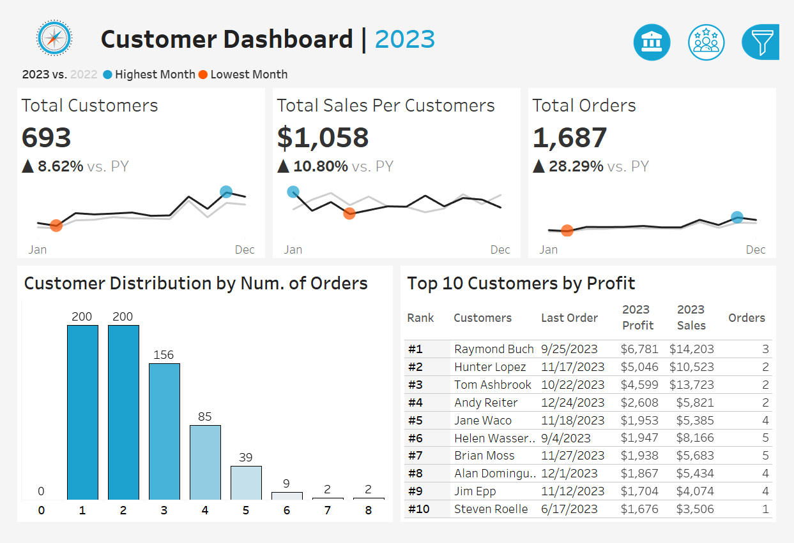

# 📊 Tableau User Story | Sales Performance

🔗 **View Dashboard on Tableau Public**:  
[Sales & Customer Dashboard](https://public.tableau.com/app/profile/ishan.prabhune/viz/SalesCustomerDashboard_17490554888950/SalesDashboard)

---

## 📝 Introduction

This user story outlines the design and functionality of two Tableau dashboards created to help stakeholders—such as sales managers and executives—analyze sales performance and understand customer behavior. The project is divided into:

- **Sales Dashboard**
- **Customer Dashboard**

---

## 📈 Sales Dashboard

### 🎯 Dashboard Purpose
To present an overview of sales metrics and trends, enabling year-over-year (YoY) performance analysis and insights into sales drivers.

### ✅ Key Requirements

#### 1. KPI Overview
- Total Sales, Profits, and Quantity  
- Comparison between current year and previous year

#### 2. Sales Trends
- Monthly KPIs for current and previous year  
- Visual indicators for highest and lowest months

#### 3. Product Subcategory Comparison
- Compare sales and profit across product subcategories  
- Visual differentiation of YoY performance

#### 4. Weekly Trends for Sales & Profit
- Weekly performance data for current year  
- Average weekly values  
- Highlights for weeks above and below average

---

## 👥 Customer Dashboard

### 🎯 Dashboard Purpose
To provide insights into customer trends and segmentation to support marketing strategies and customer engagement efforts.

### ✅ Key Requirements

#### 1. KPI Overview
- Total Number of Customers  
- Total Sales per Customer  
- Total Number of Orders  
- Comparison between current year and previous year

#### 2. Customer Trends
- Monthly KPIs for both years  
- Easy recognition of peak and low months

#### 3. Customer Distribution by Number of Orders
- Visual representation of customer engagement levels  
- Insights into loyalty and order frequency

#### 4. Top 10 Customers by Profit
- List of top 10 most profitable customers  
- Details include: rank, number of orders, sales, profit, last order date

---

## 📂 Dataset
> *Note: Add a brief description of your dataset here, or upload a sample CSV file if you're allowed to.*

---

## 🛠 Tools Used
- **Tableau Public** for dashboard development and sharing  
- **Data Preparation Tools** (mention if Excel, SQL, or other tools were used)

---

## 📌 Author
**Ishan Prabhune**  
🔗 [Tableau Public Profile](https://public.tableau.com/app/profile/ishan.prabhune)

---

## 📥 How to Use
1. Visit the Tableau Public link above.
2. Interact with filters, tooltips, and visualizations.
3. Use insights to inform sales strategies and customer engagement efforts.

---

